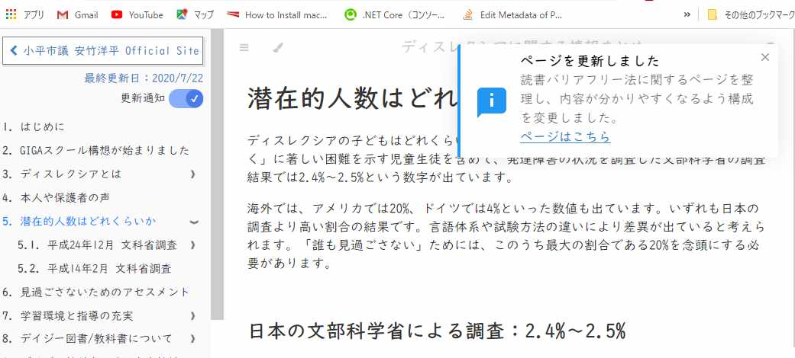
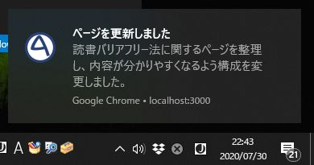

# 更新通知について

更新通知をONにすると、このサイトに新しい情報が加わった際にお知らせします。

## 更新通知が表示される場所
ブラウザでこのサイトを開いている場合は以下のような場所に表示されます。

別のサイトを開いていたり、ブラウザを最小化していたり、ブラウザを閉じていて再度開いた場合は、以下のような場所に表示されます。

## 更新通知がONにならない場合
ブラウザで通知がブロックされている可能性があります。
以下を参考に、通知を許可してください。

＊作成中